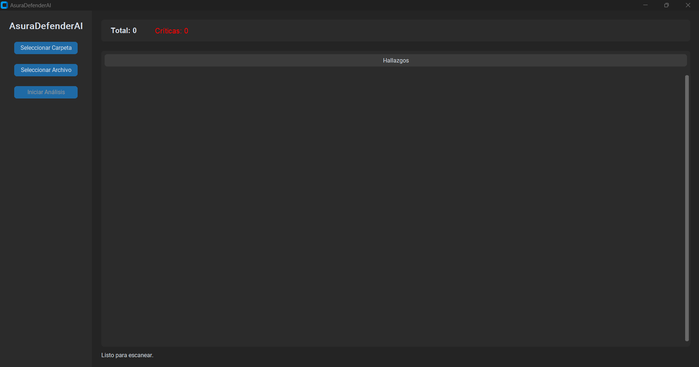
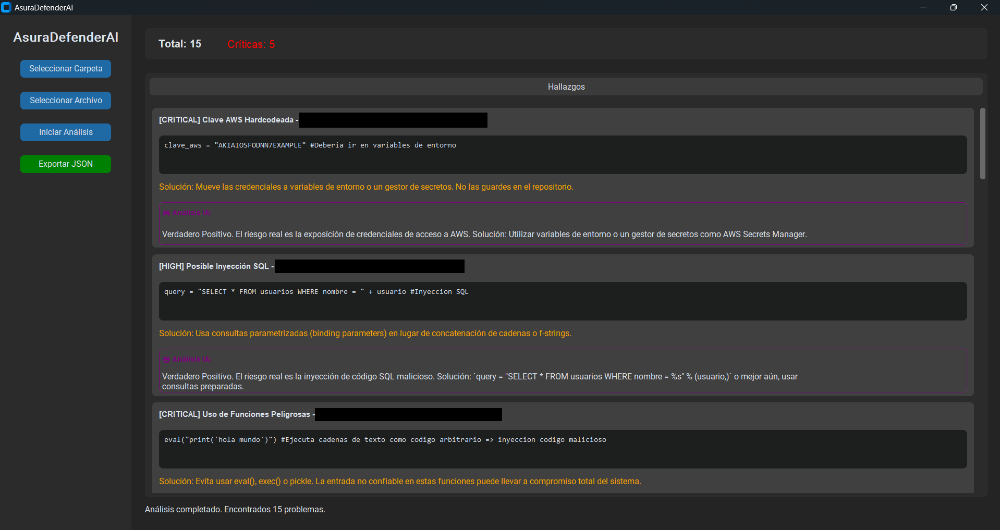
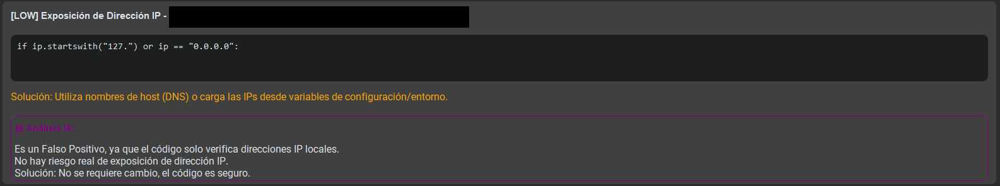

# AsuraDefenderAI


**AsuraDefenderAI** is a next-generation Static Application Security Testing (SAST) tool that bridges the gap between traditional code scanning and modern AI capabilities. Designed for developers and security auditors, it provides a robust, dual-layer analysis engine to detect, verify, and remediate security vulnerabilities in applications.

Unlike standard linters that flood you with false positives, AsuraDefenderAI integrates a **Senior Security Auditor AI (powered by Groq Llama 3)** to intelligently review every finding, ensuring you focus only on real risks with actionable, one-line fixes.

---

## 🚀 Key Features

*   **🛡️ Hybrid Analysis Engine**: Combines fast, rule-based static analysis with deep-learning AI verification.
*   **🤖 AI-Powered Triage**: Automatically employs Groq (Llama 3-70b) to review flagged code snippets, distinguishing between true risks and false positives.
*   **💻 Modern GUI**: A sleek, dark-themed interface built with `CustomTkinter`, optimized for ease of use and visual clarity.
*   **📊 Comprehensive Reporting**: Detailed JSON export functionality that includes both static findings and AI insights for audit trails.
*   **⚡ Real-Time Feedback**: Live scanning metrics, severity classification (Critical, High, Medium, Low), and instant fix suggestions.

## 📸 Screenshots

### Modern Interface


### Intelligent Analysis
| Analysis Results | False Positive Detection |
|:---:|:---:|
|  |  |

## 🛠️ Installation

### Prerequisites
*   Python 3.8+
*   A [Groq API Key](https://console.groq.com/) for AI features.

### Setup

1.  **Clone the repository**
    ```bash
    git clone https://github.com/yourusername/AsuraDefenderAI.git
    cd AsuraDefenderAI
    ```

2.  **Install dependencies**
    ```bash
    pip install -r requirements.txt
    ```

3.  **Configure Environment**
    Create a `.env` file in the root directory and add your Groq API key:
    ```env
    GROQ_API_KEY=gsk_yoursupersecretkey...
    ```

## 🖥️ Usage

### Quick Start (Recommended)
Run the launcher to automatically check and install missing dependencies:
```bash
python launcher.py
```

### Manual Start
Building the application directly:
```bash
python main.py
```

### Workflow
1.  **Select Target**: Use the GUI to select a specific Python file or an entire directory to scan.
2.  **Start Scan**: Click "Iniciar Análisis". The tool will first perform a static scan, then automatically send findings to the AI reviewer.
3.  **Review & Export**: View the results card-by-card with AI commentary. Click "Exportar JSON" to save a detailed report.

## 📂 Project Structure

*   `core/`: Core logic for static analysis (`analyzer.py`) and AI review (`ai_reviewer.py`).
*   `engine/`: Base scanning engine.
*   `gui/`: User Interface implementation using CustomTkinter.
*   `rules/`: Security rule definitions (e.g., SQL Injection, Hardcoded Secrets).
*   `main.py`: Application entry point.
*   `launcher.py`: Dependency checker and launcher script.

## 🤝 Contributing

Contributions are welcome! Please feel free to submit a Pull Request.

## 📄 License

This project is licensed for **Personal Use Only**. Commercial use and redistribution for profit are strictly prohibited. See the [LICENSE](LICENSE) file for details.
